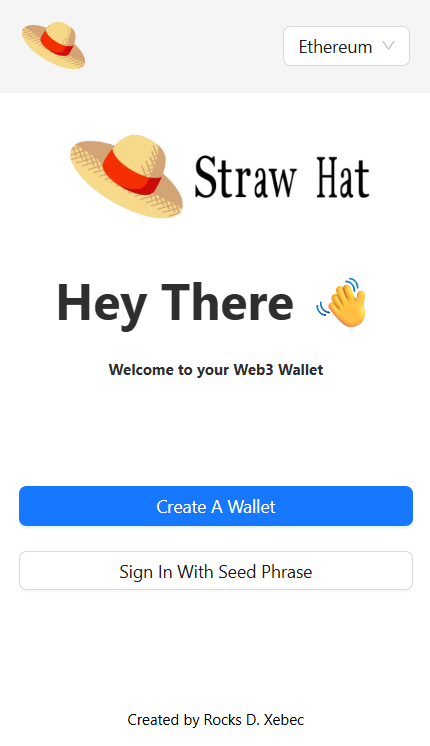
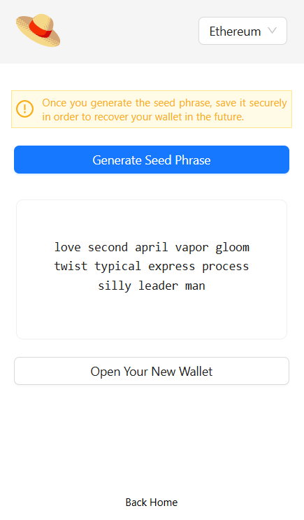
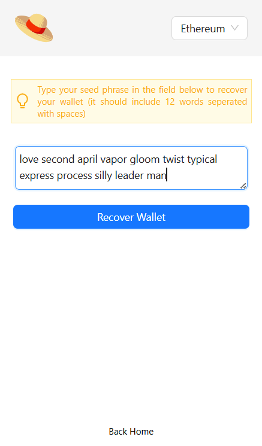
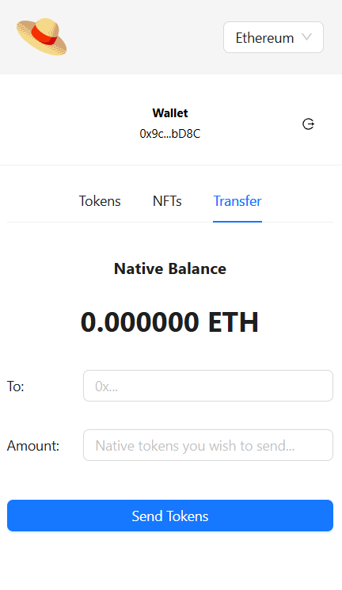

## 🪙 Crypto Wallet Extension

A full-stack cryptocurrency wallet browser extension built with **React.js (frontend)** and **Node.js (backend)**.
It allows users to **create, recover, and manage crypto wallets** directly from the browser.

---

### 🚀 Features

* 🔐 Create & Recover Wallets
* 💰 View and manage balances
* ⚙️ Connect with blockchain via Moralis
* 🌐 React-based popup interface for extension UI
* 🧩 Node.js backend API for transaction handling

---

### ⚙️ Installation

#### 1️⃣ Clone the repository

```bash
git clone https://github.com/<your-username>/Crypto_Wallet_Extension.git
cd Crypto_Wallet_Extension-master
```

#### 2️⃣ Setup backend

```bash
cd backend
node index.js

```

#### 3️⃣ Setup frontend

```bash
cd ../frontend
npm install
npm run start
```

---

### 🧩 Load as Chrome Extension

1. Run `npm run build` in the **frontend** folder.
2. Go to `chrome://extensions/` → enable **Developer Mode**.
3. Click **Load unpacked** → select the `build/` folder inside `frontend`.
4. The extension should appear in your browser.

---

### 🔗 Tech Stack

| Layer      | Technology                      |
| ---------- | ------------------------------- |
| Frontend   | React.js, JavaScript, HTML, CSS |
| Backend    | Node.js, Express                |
| Blockchain | Moralis SDK / Web3.js           |
| Extension  | Chrome Manifest v3              |

---

### 🧑‍💻 Scripts

**Frontend**

```bash
npm start     # Run in dev mode
npm run build # Build production version
```

**Backend**

```bash
node index.js     # Start backend server
```

---

### 📂 Environment Variables

Create a `.env` file in the **backend** and **frontend** directories if required.

Example:

```
MORALIS_API_KEY=<your_moralis_key>
PORT=5000
```

---

### 🧠 Future Enhancements

* Multi-chain wallet integration
* NFT viewing support
* Transaction history page
* Improved UI/UX for better user flow

---
### 📸 Screenshots

 #### Home Page

  

 ####  Create Account Page

  

  
 ####  Recover Page

  
  
 ####  Wallet View Page

  


---


